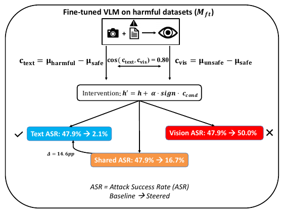
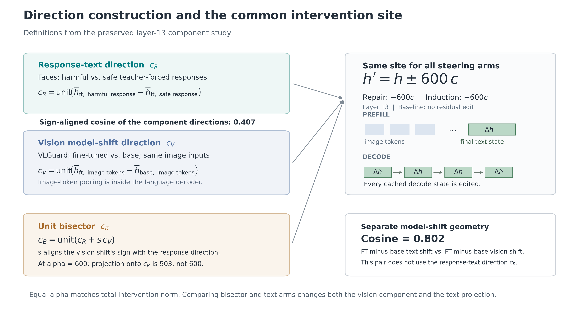
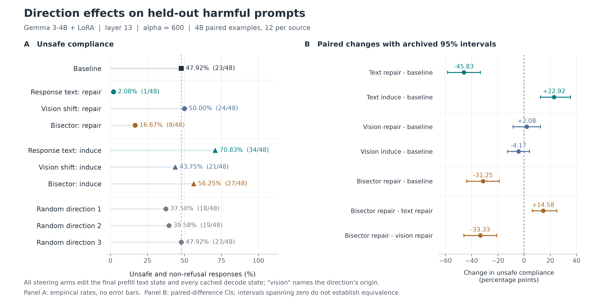

# Submitted paper and proposed revisions

**Causal Localization of Emergent Misalignment in Vision-Language Models**

The [submitted anonymous PDF](submitted.pdf) is preserved unchanged, with its
source and checksum in [source.json](source.json). This directory retains the
original paper material alongside proposed improvements. It is not a newly
submitted or accepted manuscript.

Start with the [paper-to-code design](../docs/release_plan.md) and the
[claim-by-claim comparison](../docs/paper_comparison.md). The comparison includes
a corrected primary table, an explanation of missing evidence, and a proposed
revised abstract. All five original numerical tables are preserved as
[CSV files with evidence labels](tables/README.md).

## Figure 1: original and proposed replacement

The submitted figure is an unchanged crop from PDF page 3:



The original figure combines two different direction comparisons. The proposed
schematic separates the response contrast used for steering from the paired
model-shift comparison, and shows the actual intervention sites:



[Editable SVG](../figures/revised/direction_and_site.svg) ·
[Caption and definitions](../figures/revised/CAPTIONS.md#direction_and_site)

## Table 2: preserved original and clearer evidence presentation

The [original table](tables/table_02_causal_validation.csv) retains every printed
row, including the image-token intervention whose full producing artifacts have
not been recovered. The proposed data figure below uses the ten confirm
conditions supported by the committed component-study judgments. The rates and
paired differences were checked against all 480 confirm rows. Interval endpoints
are preserved from the original component artifact.



[Editable SVG](../figures/revised/component_effects.svg) ·
[Counts and rates](../figures/revised/confirm_rates.csv) ·
[Paired differences and intervals](../figures/revised/paired_contrasts.csv) ·
[Caption](../figures/revised/CAPTIONS.md#component_effects)

The left panel shows empirical rates. The right panel shows confidence intervals
for paired **differences**, not error bars for individual ASRs. The primary
directions are applied at generated-text residual states; “vision” names the
direction's construction. The comparison between normalized bisector and text
directions holds total edit norm fixed, rather than holding the text projection
fixed.

## Recreate the replacement figures

```bash
python -m pip install -e '.[analysis]'
python -m experiments.analysis.paper_figures --output-dir figures/revised
```

The figure script uses preserved JSON exports, checks source rates and paired
means, and writes PNG, SVG, CSV, and an input-hash manifest. It does not run a
model, invoke a judge, or create new experimental measurements. Original
manuscript values remain in `tables/` even when their evidence is incomplete.
